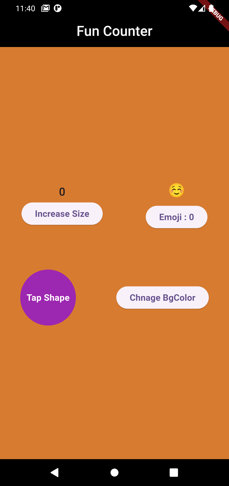

🚀 Objective
To strengthen understanding of StatefulWidget and how the setState() method works in Flutter by building a dynamic and interactive UI.

🧠 Concept
This isn’t just a simple counter — it’s a counter with personality!
Each time the increment button is tapped, the UI changes in a meaningful and visually engaging way using setState().

🎨 Features
We’ve added creative twists to the traditional counter:

✅ Emoji Mood Counter – Displays different emojis based on the current count

✅ Color Change Counter – The background color changes randomly with each button press.

✅ Font Size Grower – The emoji's font size increases as the counter increases for added fun.

🛠️ Technologies Used
Flutter
Dart
StatefulWidget and setState()

📷 Screenshots

📁 Folder Structure

lib/ 
 └── main.dart       
 └── fun_counter.dart   

How to Run
Make sure Flutter SDK is installed.

Clone this repository: 
git clone https://github.com/your-username/fun_counter.git

Navigate to the project folder: 
cd fun_counter

Run the app: 
flutter run

